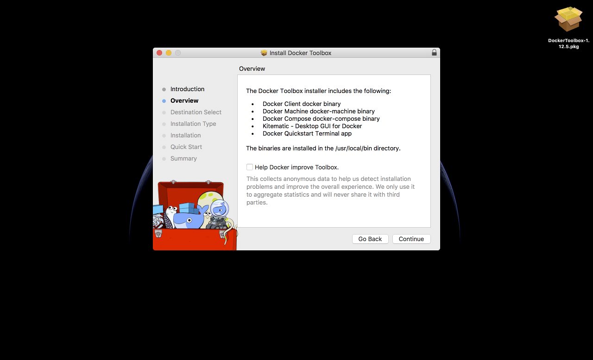
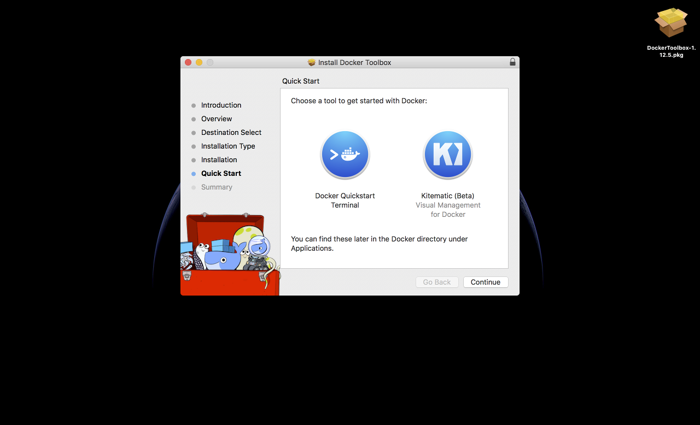
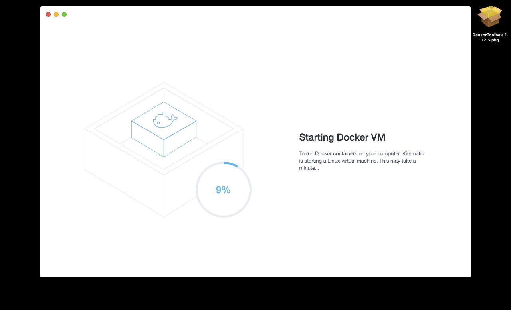
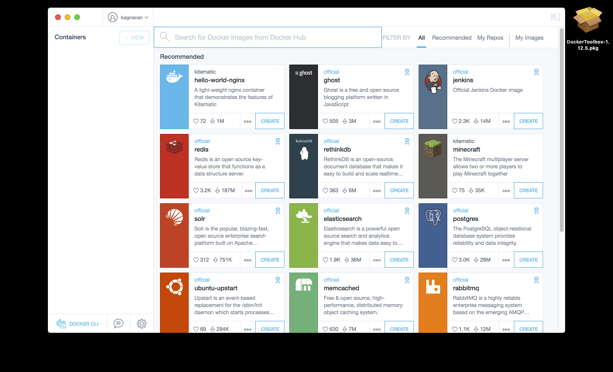
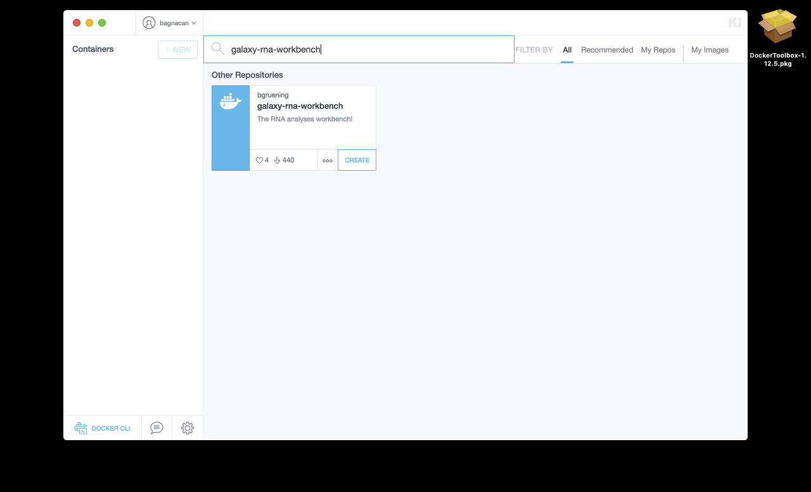
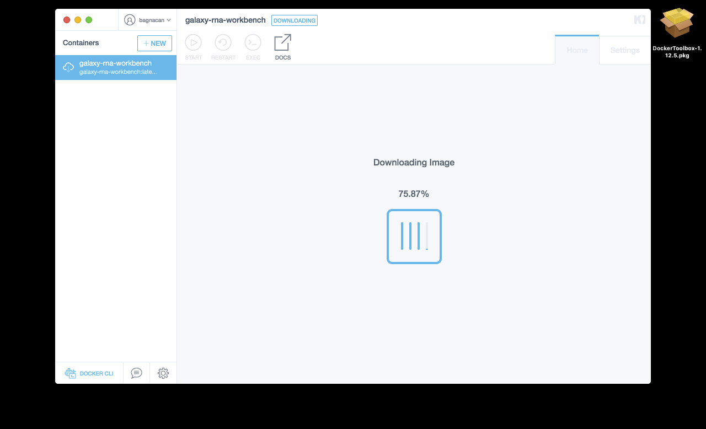
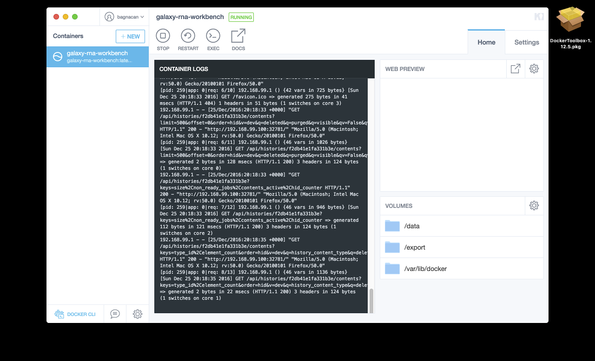
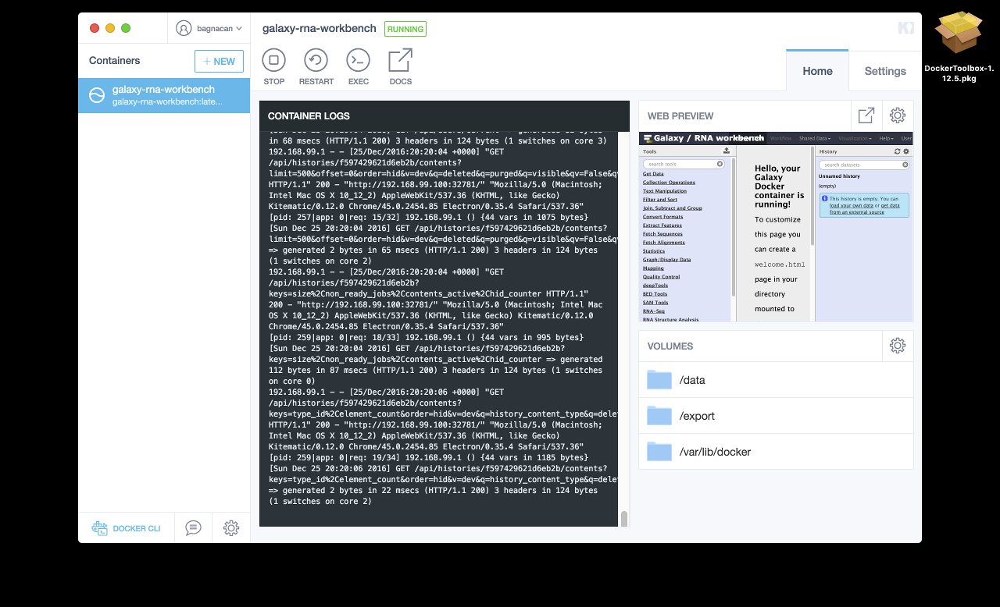
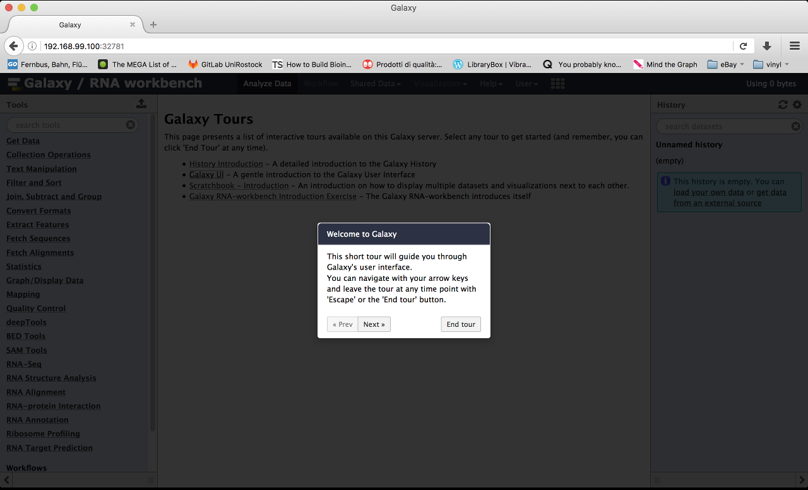

# Galaxy RNA workbench on Kitematic for Mac OSX

This how-to will guide you through the steps that are needed to run the Galaxy RNA workbench on MacOSX by setting up [Kitematic](https://kitematic.com), which provides a graphical user interface to run Docker containers stored on DockerHub

## Installation prerequisites

Before proceeding, make sure your system is up to date using App Store's update manager.  
Finally, go to Kitematic's [page](https://kitematic.com/), and download the *Docker Toolbox*.  

## Installation procedure

1. Place the downloaded installer where it is more convenient for you. Here we placed it on the Desktop for clarity.  
  Once the Docker Toolbox package is fully downloaded, double-click to proceed to its installation.  
  

2. The Docker Toolbox installer starts. Click _Continue_ to proceed with the installation.  
  

3. The installer gives an overview of what is provided in the Docker Toolbox. As you can see, Kitematic is going to be installed alongside Docker, providing a desktop GUI for managing its images and containers. Click _Continue_.  
  

4. Click on the drive where you want to install the Docker Toolbox. Click _Continue_.  
  

5. The Docker Toolbox installer provides different types of installations. Here you can select the different components that are required to run Docker images. Click _Customize_ to review the components and fine-tune your installation, or leave the installation at its defaults (what we did here) by clicking _Install_.  
  

6. The Docker Toolbox installer lets you choose how you would like to start managing Docker images. From here, you can either click _Continue_ to finalize the installation (and later find Kitematic within your system's Applications directory), or between the *Docker Quickstart Terminal* and *Kitematic* to readilly start managin Docker images. Click on _Kitematic_ to overview its Docker GUI.  
  

7. The Docker GUI starts. Let it load.  
  

8. Once loaded, the GUI asks you to connect to the Docker Hub to retrieve publicly available Docker images.  
  Insert your credentials, and click _Login_.  
  

9. Once logged in, the GUI shows some popular Docker images readilly available for running on your system.  
  We are interested in the _Galaxy RNA workbench_. Type _galaxy-rna-workbench_ in the search bar located on the top of the window to search for this image on the Docker Hub.  
  

10. The search dialog shows the retrieved results. Select the first on the left by clicking _Create_.  
  

11. A connection to the Docker Hub is started, and the workbench is retrieved from the Docker Hub.  
  

12. Once fully downloaded, the Docker container starts, loggin messages on the console.  
  

13. A web preview of the Galaxy RNA workbench is provided next to the console log.  
  Click on the preview image to open it in a browser.  
  

14. The web preview is fully opened in your default browser, where you can readilly start working on the workbench.  
  

15. To start trying the workbench, we suggest you take an interactive tour of the galaxy workbench.  
The tour can be stopped at any time, and gives you an overview of what you can do through the interface, using its tools, and reusing all available workflows. Click on _Help -> Interactive Tours_.  

16. The interactive tours are listed. Click on the _Galaxy UI_ introductory tour.  
  

17. Your Galaxy RNA workbench tour has started. Have fun :)  
  

Once finished, finalize your installation by clicking _Continue_ in the Docker Toolbox installer.  
This will create a Kitematic icon in your system's Applications directory, and close the Docker Toolbox installer.

