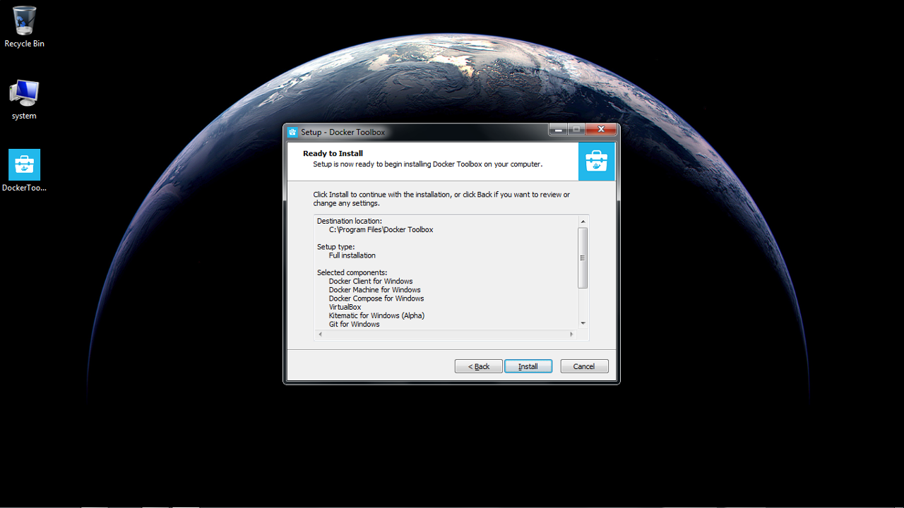
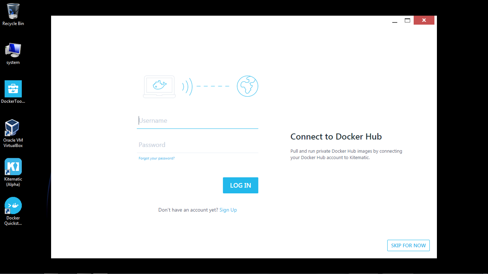
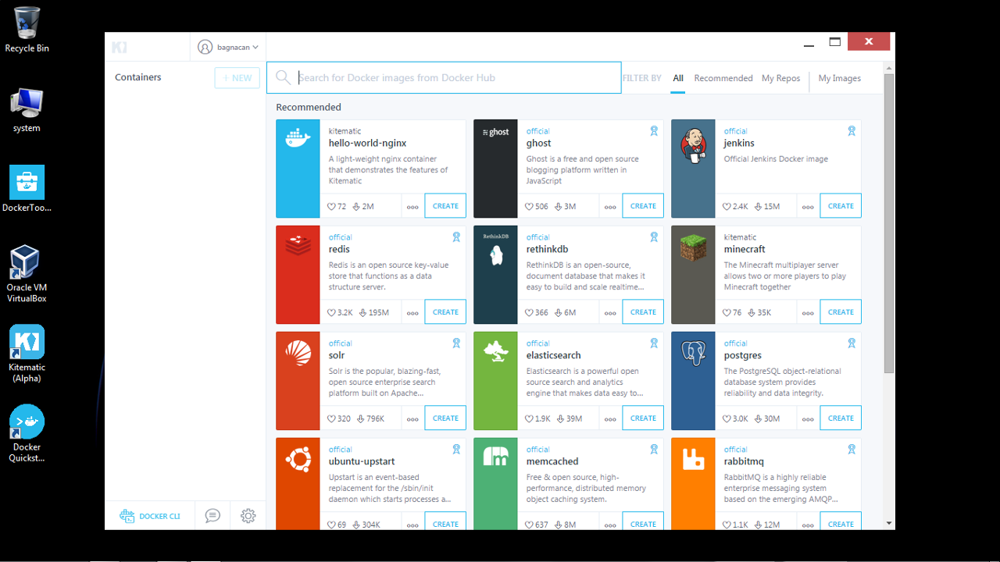

# Galaxy RNA workbench on Kitematic for Windows

This how-to will guide you through the steps that are needed to run the Galaxy RNA workbench on Windows by setting up [Kitematic](https://kitematic.com), which provides a graphical user interface to run Docker containers stored on DockerHub

## Installation prerequisites

Before proceeding, make sure your system is up to date using Microsoft's Windows Update.  
Finally, go to Kitematic's [page](https://kitematic.com/), and download the *Docker Toolbox*.  

## Installation procedure

1. Place the downloaded installer where it is more convenient for you. Here we placed it on the Desktop for clarity.  
  Once the Docker Toolbox package is fully downloaded, double-click to proceed to its installation.  
  

2. The Docker Toolbox installer starts. Click _Next_ to proceed with the installation.  
  

3. Set the location where you want to install the Docker Toolbox. Click _Next_.  
  

4. The installer gives an overview of what is provided in the Docker Toolbox. As you can see, Kitematic is going to be installed alongside Docker, providing a desktop GUI for managing its images and containers. Click _Next_.  
  

5. Leave the post-installation tasks to their default to obtain all Docker Toolbox's desktop icons. Click _Next_.  
  

6. Review the provided installation location and components. Click _Install_.  
  

7. The installation completes by creating all Docker Toolbox's icons in the defined location. By leaving the settings at their defaults, these will appear on the desktop. Click _Finish_.  
  

8. The Docker GUI starts. Let it load.  
  

9. Once loaded, the GUI asks you to connect to the Docker Hub to retrieve publicly available Docker images.  
  Insert your credentials, and click _Login_.  
  

10. Once logged in, the GUI shows some popular Docker images readilly available for running on your system.  
  We are interested in the _Galaxy RNA workbench_. Type _galaxy-rna-workbench_ in the search bar located on the top of the window to search for this image on the Docker Hub.  
  

11. The search dialog shows the retrieved results. Select the first on the left by clicking _Create_.  
  

12. A connection to the Docker Hub is started, and the workbench is retrieved from the Docker Hub.  
  

13. Once fully downloaded, the Docker container starts, loggin messages on the console. A web preview of the Galaxy RNA workbench is provided next to the console log. Click on the preview window to open it in a browser.  
  

14. The web preview is fully opened in your default browser, where you can readilly start working on the workbench.  
  The opening page shows some useful options to configure Galaxy, install new tools, or try the workbench through a guided tour: an interactive demo showing the usage of preloaded tools to carry out a simple workflow experiment.  
  Tours can be stopped at any time, and provide you an overview of what can be done through Galaxy, using its tools, and reusing all available workflows.  
  

15. To have an introductory tour on the Galaxy interface, Click on _Help -> Interactive Tours_, and select the _Galaxy UI_ tour.  
  Your Galaxy RNA workbench tour has started. Have fun :)  
  

