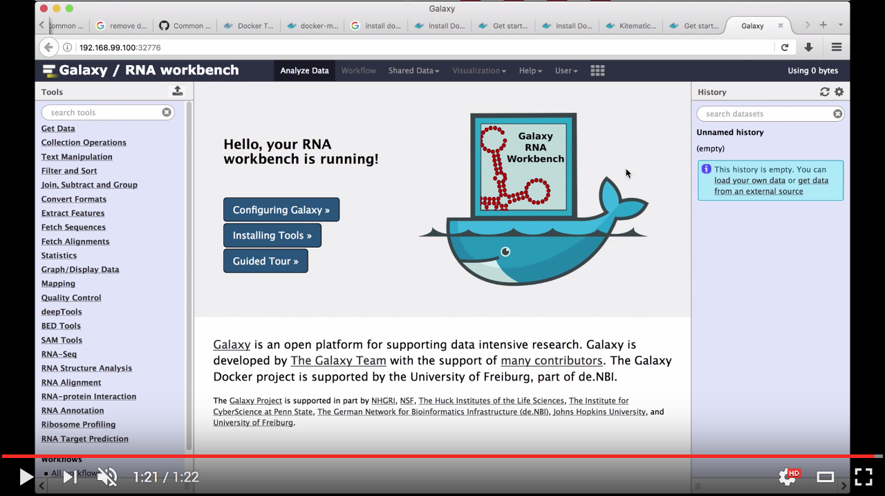
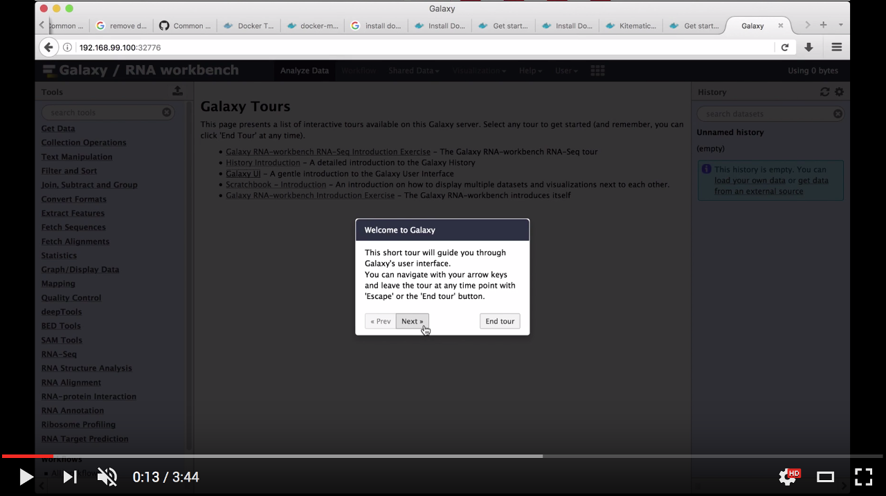

# About
[](https://doi.org/10.1093/nar/gkx409)


<div id="top"></div>


The RNA Galaxy workbench is a comprehensive set of analysis tools and consolidated workflows. The workbench is based on the Galaxy framework, which guarantees simple access, easy extension, flexible adaption to personal and security needs, and sophisticated analyses independent of command-line knowledge.

The current implementation comprises more than 50 bioinformatics tools dedicated to different research areas of RNA biology, including RNA structure analysis, RNA alignment, RNA annotation, RNA-protein interaction, ribosome profiling, RNA-Seq analysis, and RNA target prediction.

The workbench is developed by the RNA Bioinformatics Center (RBC). This center is one of the eight service units of the [German Network for Bioinformatics Infrastructure](http://www.denbi.de), running the German [ELIXIR Node](https://www.elixir-europe.org/).

[](http://www.denbi.de)
[](https://www.elixir-europe.org)

- [Usage](#usage)
  - [Requirement](#requirement)
  - [Docker configuration](#docker-configuration)
  - [RNA workbench launch](#rna-workbench-launch)
  - [Users and passwords](#users-and-passwords)
  - [Tours](#tours)
- [Available tools](#available-tools)
  - [RNA structure prediction and analysis](#rna-structure-prediction-and-analysis)
  - [RNA alignment](#rna-alignment)
  - [RNA annotation](#rna-annotation)
  - [RNA-protein interaction](#rna-protein-interaction)
  - [RNA-RNA interaction](#rna-rna-interaction)
  - [RNA target prediction](#rna-target-prediction)
  - [Ribosome profiling](#ribosome-profiling)
  - [RNA-Seq and HTS analysis](#rna-seq-and-hts-analysis)
- [Training](#training)
- [Contributors](#contributors)
- [How to contribute](#how-to-contribute)
- [Support and bug reports](#support-and-bug-reports)
- [MIT license](#mit-license)

# Usage

The RNA analyses workbench implements a webserver based on the [Galaxy Docker](https://github.com/bgruening/docker-galaxy-stable) platform: a dedicated Galaxy instance wrapped in a Docker container. For advanced local deployments, we recommend to check out the upstream [documentation](http://bgruening.github.io/docker-galaxy-stable).
<p align="right"><a href="#top">&#x25B2; back to top</a></p>

## Requirement

To use the Galaxy RNA workbench, you only need [Docker](https://www.docker.com/products/overview#h_installation), which can be installed in different ways, depending on the type of system you're running:
- non-linux users are encouraged to use [Kitematic](https://kitematic.com), which provides a Docker installation for [OSX](https://github.com/bgruening/galaxy-rna-workbench/blob/master/howto_kitematic_osx.md) or [Windows](https://github.com/bgruening/galaxy-rna-workbench/blob/master/howto_kitematic_win.md), coupled with a user friendly interface to run Docker containers;
- linux users and people familiar with the command line can follow the instruction on installing Docker from its [website](https://docs.docker.com/installation).
<p align="right"><a href="#top">&#x25B2; back to top</a></p>

## Docker configuration

The RNA workbench docker container is rather large and expected to grow when further tools and workflows are contributed. So for users new to docker, we list here some tweaks that can help to work around issues when first using docker.
After successful installation of docker, it is recommended to configure some settings, dealing for example with the storage space required by containers. You can find more information [here](howtodocker.md).
<p align="right"><a href="#top">&#x25B2; back to top</a></p>

## RNA workbench launch

Whether you run Docker images using Kitematic or the command line interface, the procedure to launch the RNA workbench varies.

### Using Kitematic

Kitematic users can launch the RNA workbench directly from its interface. The following video shows how to load the docker container that is necessary to use the workbench:

[](https://www.youtube.com/watch?v=fYer4Xdw_h4)
<p align="right"><a href="#top">&#x25B2; back to top</a></p>

### Without Kitematic

For non-Kitematic users, starting the RNA workbench is analogous to start the generic Galaxy Docker image:

```
$ docker run -d -p 8080:80 quay.io/bgruening/galaxy-rna-workbench
```

A detailed discussion of Docker's parameters is given in the [Docker manual](http://docs.docker.io/). It is really worth reading. Nevertheless, here is a quick rundown:

- `docker run` starts the Image/Container

   In case the Container is not already stored locally, docker downloads it automatically

- The argument `-p 8080:80` makes the port 80 (inside of the container) available on port 8080 on your host

    Inside the container a Apache web server is running on port 80 and that port can be bound to a local port on your host computer.
    With this parameter you can access your Galaxy instance via `http://localhost:8080` immediately after executing the command above

- `quay.io/bgruening/galaxy-rna-workbench` is the Image/Container name, that directs docker to the correct path in the [docker index](https://quay.io/repository/bgruening/galaxy-rna-workbench)
- `-d` will start the docker container in Daemon mode.

  For an interactive session, one executes:

  ```
  $ docker run -i -t -p 8080:80 quay.io/bgruening/galaxy-rna-workbench /bin/bash
  ```

  and manually invokes the `startup` script to start PostgreSQL, Apache and Galaxy.

Docker images are "read-only". All changes during one session are lost after restart. This mode is useful to present Galaxy to your colleagues or to run workshops with it.

To install Tool Shed repositories or to save your data, you need to export the calculated data to the host computer. Fortunately, this is as easy as:

```
$ docker run -d -p 8080:80 -v /home/user/galaxy_storage/:/export/ quay.io/bgruening/galaxy-rna-workbench
```

Given the additional `-v /home/user/galaxy_storage/:/export/` parameter, docker will mount the folder `/home/user/galaxy_storage` into the Container under `/export/`. A `startup.sh` script, that is usually starting Apache, PostgreSQL and Galaxy, will recognize the export directory with one of the following outcomes:

- In case of an empty `/export/` directory, it will move the [PostgreSQL](http://www.postgresql.org/) database, the Galaxy database directory, Shed Tools and Tool Dependencies and various configure scripts to /export/ and symlink back to the original location.
- In case of a non-empty `/export/`, for example if you continue a previous session within the same folder, nothing will be moved, but the symlinks will be created.

This enables you to have different export folders for different sessions - meaning real separation of your different projects.

It will start the Galaxy RNA workbench with the configuration and launch of a Galaxy instance and its population with the needed tools. The instance will be accessible at [http://localhost:8080](http://localhost:8080).

> For a more specific configuration, you can have a look at the [documentation of the Galaxy Docker Image](http://bgruening.github.io/docker-galaxy-stable/).

<p align="right"><a href="#top">&#x25B2; back to top</a></p>

## Users and passwords

The Galaxy Admin User has the username `admin@galaxy.org` and the password `admin`.
In order to use certain features of Galaxy, like e.g. the RNA structure visualization, one has to be logged in.
Also the installation of additional tools requires a login.

The PostgreSQL username is `galaxy`, the password `galaxy` and the database name `galaxy`.

If you want to create new users, please make sure to use the `/export/` volume. Otherwise your user will be removed after your docker session is finished.
<p align="right"><a href="#top">&#x25B2; back to top</a></p>

## Tours

The RNA workbench provides the possibility to run interactive tours that illustrate how the main interface works in relation to real-life user tasks. These show many common operations, such as searching, parametrizing, and running tools, or saving a history of operations in a sharable workflow.

The following video demonstrates the main elements that compose the Galaxy user interface:

[](https://www.youtube.com/watch?v=rP59wYIxWcI)
<p align="right"><a href="#top">&#x25B2; back to top</a></p>

# Available tools

In this section we list all tools that have been integrated in the RNA workbench. The list is likely to grow as soon as further tools and workflows are contributed. To ease readability, we divided them into categories.
<p align="right"><a href="#top">&#x25B2; back to top</a></p>

## RNA structure prediction and analysis

Tool | Description | Reference
--- | --- | ---
[CMCompare](http://nibiru.tbi.univie.ac.at/cmcws/introduction.html) | Tool to compare RNA families via covariance models | [Eggenhofer et al. 2013](https://doi.org/10.1093/nar/gkt329)
[CoFold](https://www.e-rna.org/cofold/) | A thermodynamics-based RNA secondary structure folding algorithm | [Proctor et al. 2013](https://doi.org/10.1093/nar/gkt174)
[Kinwalker](http://www.bioinf.uni-leipzig.de/Software/Kinwalker/) | Algorithm for cotranscriptional folding of RNAs to obtain the min. free energy structure | [Geis et al. 2008](https://doi.org/10.1016/j.jmb.2008.02.064)
[MEA](http://www.bioinf.uni-leipzig.de/Software/mea/) | Prediction of maximum expected accuracy RNA secondary structures | [Amman et al. 2013](https://doi.org/10.1007/978-3-319-02624-4_1)
[RNAlien](http://rna.tbi.univie.ac.at/rnalien/) | Unsupervised covariance model construction from a single input sequence | [Eggenhofer et al. 2016](https://doi.org/10.1093/nar/gkw558)
[RNAshapes](https://bibiserv2.cebitec.uni-bielefeld.de/rnashapes) | Structures to a tree-like domain of shapes, retaining adjacency and nesting of structural features | [Janssen et al. 2014](https://doi.org/10.1093/bioinformatics/btu649)
[RNAz](http://www.tbi.univie.ac.at/~wash/RNAz/) | Predicts structurally conserved and therm. stable RNA secondary structures in mult. seq. alignments | [Gruber et al. 2010](https://doi.org/10.1142/9789814295291_0009)
[segmentation-fold](https://github.com/yhoogstrate/segmentation-fold)| An application that predicts RNA 2D-structure with an extended version of the Zuker algorithm | -
[ViennaRNA](https://www.tbi.univie.ac.at/RNA/) | A tool compilation for prediction and comparison of RNA secondary structures | [Lorenz et al. 2011](https://doi.org/10.1186/1748-7188-6-26)

<p align="right"><a href="#top">&#x25B2; back to top</a></p>

## RNA alignment

Tool | Description | Reference
--- | --- | ---
[Compalignp](http://www.biophys.uni-duesseldorf.de/bralibase/) | An RNA counterpart of the protein specific "Benchmark Alignment Database" | [Wilm et al. 2006](https://doi.org/10.1186/1748-7188-1-19)
[LocARNA](http://rna.informatik.uni-freiburg.de/LocARNA/Input.jsp) | A tool for multiple alignment of RNA molecules | [Will et al. 2012](https://doi.org/10.1261/rna.029041.111)
[MAFFT](http://mafft.cbrc.jp/alignment/software/) | A multiple sequence alignment program for unix-like operating systems | [Katoh and Standley 2016](https://doi.org/10.1093/bioinformatics/btw108)
[RNAlien](http://rna.tbi.univie.ac.at/rnalien/) | A tool for RNA family model construction | [Eggenhofer et al. 2016](https://doi.org/10.1093/nar/gkw558)
[CMV](https://github.com/eggzilla/cmv) | RNA family model visualisation | [Eggenhofer et al. 2018](https://doi.org/10.1093/bioinformatics/bty158)

<p align="right"><a href="#top">&#x25B2; back to top</a></p>

## RNA annotation

Tool | Description | Reference
--- | --- | ---
[ARAGORN](http://mbio-serv2.mbioekol.lu.se/ARAGORN/) | A tool to identify tRNA and tmRNA genes | [Laslett et al. 2004](https://doi.org/10.1093/nar/gkh152)
[FuMa (Fusion Matcher)](https://github.com/yhoogstrate/fuma) | A tool to reports identical fusion genes based on gene-name annotations | [Hoogstrate et al. 2015](https://doi.org/10.1093/bioinformatics/btv721)
[GotohScan](http://www.bioinf.uni-leipzig.de/Software/GotohScan/) | A search tool to find shorter sequences in large database sequences | [Hertel et al. 2009](https://doi.org/10.1093/nar/gkn1084)
[Infernal](http://eddylab.org/infernal/) | A tool for searching DNA sequence databases for RNA structure and sequence similarities | [Nawrocki et al. 2013](https://doi.org/10.1093/bioinformatics/btt509)
[RNABOB](http://eddylab.org/software.html) | A tool for fast pattern matching of RNA secondary structures | [Gautheret et al. 1990](https://doi.org/10.1093/bioinformatics/6.4.325)
[RNAcode](https://wash.github.io/rnacode/) | Predicts protein coding regions in a set of homologous nucleotide sequences | [Washietl et al. 2011](https://doi.org/10.1261/rna.2536111)
[RNAmmer](http://www.cbs.dtu.dk/services/RNAmmer/) | Predicts 5s/8s, 16s/18s, and 23s/28s ribosomal RNA in full genome sequences | [Lagesen et al. 2007](https://doi.org/10.1093/nar/gkm160)
[tRNAscan](http://lowelab.ucsc.edu/tRNAscan-SE/) | Searches for tRNA genes in genomic sequences | [Lowe et al. 1997](https://doi.org/10.1093/nar/25.5.955)
[RCAS](https://github.com/BIMSBbioinfo/RCAS) | A generic reporting tool for the functional analysis of transcriptome-wide regions of interest detected by high-throughput experiments | [Uyar et al. 2017](https://doi.org/10.1093/nar/gkx120)

<p align="right"><a href="#top">&#x25B2; back to top</a></p>

## RNA-protein interaction

Tool | Description | Reference
--- | --- | ---
[AREsite2](http://rna.tbi.univie.ac.at/AREsite2) | A database for AU-/GU-/U-rich elements in human and model organisms | [Fallmann et al. 2015](https://doi.org/10.1093/nar/gkv1238)
[doRiNA](https://dorina.mdc-berlin.de/) | A database of RNA interactions in post-transcriptional regulation | [Blin et al. 2014](https://doi.org/10.1093/nar/gku1180)
[PARalyzer](https://ohlerlab.mdc-berlin.de/software/PARalyzer_85/)| An algorithm to generate a map of interacting RNA-binding proteins and their targets | [Corcoran et al. 2011](https://doi.org/10.1186/gb-2011-12-8-r79)
[Piranha](https://github.com/smithlabcode/piranha) | A peak-caller for CLIP- and RIP-seq data | -

<p align="right"><a href="#top">&#x25B2; back to top</a></p>

## RNA-RNA interaction

Tool | Description | Reference
--- | --- | ---
[IntaRNA](https://github.com/BackofenLab/IntaRNA) | Efficient RNA-RNA interaction prediction incorporating accessibility and seeding of interaction sites | [Mann et al. 2017](https://doi.org/10.1093/nar/gkx279)

<p align="right"><a href="#top">&#x25B2; back to top</a></p>

## RNA target prediction

Tool | Description | Reference
--- | --- | ---
[TargetFinder](https://github.com/carringtonlab/TargetFinder) | A tool to predict small RNA binding sites on target transcripts from a sequence database | [Fahlgren et al. 2009](https://doi.org/10.1007/978-1-60327-005-2_4)
[HISAT2](https://ccb.jhu.edu/software/hisat2/) | Hierarchical indexing for spliced alignment of transcripts | [Pertea et al. 2016](https://doi.org/10.1038/nprot.2016.095)
[STAR](https://github.com/alexdobin/STAR) | Rapid spliced aligner for RNA-seq data | [Dobin et al. 2013](https://academic.oup.com/bioinformatics/article/29/1/15/272537/STAR-ultrafast-universal-RNA-seq-aligner)
[STAR-fusion](https://github.com/STAR-Fusion/STAR-Fusion) | Fast fusion gene finder | [Haas et al. 2017](https://www.biorxiv.org/content/early/2017/03/24/120295)
[Bowtie 2](http://bowtie-bio.sourceforge.net/bowtie2/index.shtml) | Fast and sensitive read alignment | [Langmead et al. 2012](https://doi.org/10.1038/nmeth.1923)
[BWA](http://bio-bwa.sourceforge.net/) | Software package for mapping low-divergent sequences against a large reference genome | [Li and Durbin 2010](https://doi.org/10.1093/bioinformatics/btp698)

<p align="right"><a href="#top">&#x25B2; back to top</a></p>

## Ribosome profiling

Tool | Description | Reference
--- | --- | ---
[RiboTaper](https://ohlerlab.mdc-berlin.de/software/RiboTaper_126/) | An analysis pipeline for Ribo-Seq experiments, exploiting the triplet periodicity of ribosomal footprints to call translated regions | [Calviello et al. 2015](https://doi.org/10.1038/nmeth.3688)
[Trinity](https://github.com/trinityrnaseq/trinityrnaseq/wiki) | A tool to assemble transcript sequences from Illumina RNA-Seq data | [Grabherr et al. 2011](https://doi.org/10.1038/nbt.1883)

<p align="right"><a href="#top">&#x25B2; back to top</a></p>

## RNA-Seq and HTS analysis

### Preprocessing

Tool | Description | Reference
--- | --- | ---
[FastQC!](http://www.bioinformatics.babraham.ac.uk/projects/fastqc/) | A quality control tool for high throughput sequence data | -
[Trim Galore!](https://www.bioinformatics.babraham.ac.uk/projects/trim_galore/) | A tool for the automation of quality and adapter trimming on paired-end or non-paired-end end sequences | -

<p align="right"><a href="#top">&#x25B2; back to top</a></p>

### Quality control

Tool | Description | Reference
--- | --- | ---
[FastQC](https://www.bioinformatics.babraham.ac.uk/projects/fastqc/) | A quality control tool for high throughput sequence data | -
[MultiQC](https://multiqc.info/) | A tool to create reports visualising output from multiple tools across many samples | [Ewels et al. 2016](https://doi.org/10.1093/bioinformatics/btw354)
[Trim Galore!](https://www.bioinformatics.babraham.ac.uk/projects/trim_galore/) | A tool for the automation of quality and adapter trimming on paired-end or non-paired-end end sequences | -

<p align="right"><a href="#top">&#x25B2; back to top</a></p>

### RNA-Seq

Tool | Description | Reference
--- | --- | ---
[Bowtie2](http://bowtie-bio.sourceforge.net/bowtie2/index.shtml) | Fast and sensitive read alignment | [Langmead et al. 2012](https://doi.org/10.1038/nmeth.1923)
[BWA](http://bio-bwa.sourceforge.net/) | Burrow-Wheeler Aligner for short-read alignment | [Li et al. 2010](https://doi.org/10.1093/bioinformatics/btp698)
[BWA-MEM](https://github.com/lh3/bwa) | Fast and accurate long-read alignment with Burrows–Wheeler transform | [Li et al. 2010](https://doi.org/10.1093/bioinformatics/btp698)
[DESeq2](https://bioconductor.org/packages/release/bioc/html/DESeq2.html) | Differential gene expression analysis based on the negative binomial distribution | [Love et al. 2014](https://doi.org/10.1186/s13059-014-0550-8)
[Dr. Disco](https://github.com/yhoogstrate/dr-disco) | Detection of exon-to-exon and genomic breakpoints in RNA-Seq data | -
[featureCounts](http://bioinf.wehi.edu.au/featureCounts/) | Ultrafast and accurate read summarization program | [Liao et al. 2013](https://doi.org/10.1093/bioinformatics/btt656)
[FlaiMapper](https://github.com/yhoogstrate/flaimapper) | A tool for computational annotation of small ncRNA-derived fragments using RNA-seq data | [Hoogstrate et al. 2014](https://doi.org/10.1093/bioinformatics/btu696)
[HISAT2](https://ccb.jhu.edu/software/hisat2/) | Hierarchical indexing for spliced alignment of transcripts | [Kim et al. 2015](https://doi.org/10.1038/nmeth.3317)
[NASTIseq](https://ohlerlab.mdc-berlin.de/software/NASTIseq_104/)| A method that incorporates the inherent variable efficiency of generating perfectly strand-specific libraries | [Li et al. 2013](https://doi.org/10.1101/gr.149310.112)
[PIPmiR](https://ohlerlab.mdc-berlin.de/software/Pipeline_for_the_Identification_of_Plant_miRNAs_84/) | An algorithm to identify novel plant miRNA genes from a combination of deep sequencing data and genomic features | [Breakfield et al. 2011](https://doi.org/10.1101/gr.123547.111)
[RNA STAR](https://github.com/alexdobin/STAR) | Ultrafast universal RNA-seq aligner | [Dobin et al. 2012](https://doi.org/10.1093/bioinformatics/bts635)
[Sailfish](https://www.cs.cmu.edu/~ckingsf/software/sailfish/) | A tool for rapid alignment-free quantification of isoform abundance | [Patro et al. 2014](https://doi.org/10.1038/nbt.2862)
[Salmon](https://github.com/COMBINE-lab/Salmon) | A tool for transcript quantification from RNA-seq data | [Patro et al. 2015](https://doi.org/10.1101/021592)
[SortMeRNA](http://bioinfo.lifl.fr/RNA/sortmerna/) | A tool for filtering, mapping and OTU-picking NGS reads in metatranscriptomic and -genomic data | [Kopylova et al. 2011](https://doi.org/10.1093/bioinformatics/bts611)
[STAR-Fusion](https://github.com/STAR-Fusion/STAR-Fusion) | A tool that leverages on the STAR aligner to identify candidate fusion transcripts supported by Illumina reads | -
[Trinity](https://github.com/trinityrnaseq/trinityrnaseq/wiki) | A tool to assemble transcript sequences from Illumina RNA-Seq data | [Grabherr et al. 2011](https://doi.org/10.1038/nbt.1883)

<p align="right"><a href="#top">&#x25B2; back to top</a></p>

### Utilities

Tool | Description | Reference
--- | --- | ---
[SAMtools](http://samtools.sourceforge.net/) | Utilities for manipulating alignments in the SAM format | [Heng et al. 2009](https://doi.org/10.1093/bioinformatics/btp352)
[BEDTools](https://bedtools.readthedocs.io/en/latest/) | Utilities for genome arithmetic | [Quinlan et al. 2010](https://doi.org/10.1093/bioinformatics/btq033)
[deepTools](https://deeptools.readthedocs.io/en/develop/) | A suite of tools for exploring hight-throughput sequencing data, such as ChIP-seq, RNA-seq, and MNase-seq | [Ramirez et al. 2016](https://doi.org/10.1093/nar/gkw257)

<p align="right"><a href="#top">&#x25B2; back to top</a></p>

# Training

To learn about RNA sequencing data analysis, we recommend you to have a look at the training material from the [Galaxy Training network](https://galaxyproject.github.io/training-material/topics/transcriptomics/), particularly the tutorial on [Reference-based RNA-seq data analysis](https://galaxyproject.github.io/training-material/topics/transcriptomics/tutorials/ref-based/tutorial.html).

In the Galaxy RNA workbench, we also included [Galaxy interactive tours](https://github.com/galaxyproject/galaxy-tours) to guide you through the Galaxy, it's tools and possibilities.

<p align="right"><a href="#top">&#x25B2; back to top</a></p>

# Contributors

 - [Andrea Bagnacani](https://github.com/bagnacan)
 - [Bérénice Batut](https://github.com/bebatut)
 - [Florian Eggenhofer](https://github.com/eggzilla)
 - [Joerg Fallmann](https://github.com/jfallmann)
 - [Bjoern Gruening](https://github.com/bgruening)
 - [Youri Hoogstrate](https://github.com/yhoogstrate)
 - [Torsten Houwaart](https://github.com/TorHou)
 - [Cameron Smith](https://github.com/smithcr)
 - [Pavankumar Videm](https://github.com/pavanvidem)
 - [Sebastian Will](https://github.com/s-will)
 - [Markus Wolfien](https://github.com/mwolfien)
 - [Dilmurat Yusuf](https://github.com/dyusuf)

<p align="right"><a href="#top">&#x25B2; back to top</a></p>

# How to contribute

The RNA-workbench community welcomes new contributions and help in any way.
We have collected detailed instructions and some guidance in our [CONTRIBUTING.md](https://github.com/bgruening/galaxy-rna-workbench/blob/master/CONTRIBUTING.md).

# Support and bug reports

For support, questions, or feature requests fill bug reports on our [issue page](https://github.com/bgruening/galaxy-rna-workbench/issues).
<p align="right"><a href="#top">&#x25B2; back to top</a></p>

# MIT license

Permission is hereby granted, free of charge, to any person obtaining a copy
of this software and associated documentation files (the "Software"), to deal
in the Software without restriction, including without limitation the rights
to use, copy, modify, merge, publish, distribute, sublicense, and/or sell
copies of the Software, and to permit persons to whom the Software is
furnished to do so, subject to the following conditions:

The above copyright notice and this permission notice shall be included in
all copies or substantial portions of the Software.

THE SOFTWARE IS PROVIDED "AS IS", WITHOUT WARRANTY OF ANY KIND, EXPRESS OR
IMPLIED, INCLUDING BUT NOT LIMITED TO THE WARRANTIES OF MERCHANTABILITY,
FITNESS FOR A PARTICULAR PURPOSE AND NONINFRINGEMENT. IN NO EVENT SHALL THE
AUTHORS OR COPYRIGHT HOLDERS BE LIABLE FOR ANY CLAIM, DAMAGES OR OTHER
LIABILITY, WHETHER IN AN ACTION OF CONTRACT, TORT OR OTHERWISE, ARISING FROM,
OUT OF OR IN CONNECTION WITH THE SOFTWARE OR THE USE OR OTHER DEALINGS IN
THE SOFTWARE.
<p align="right"><a href="#top">&#x25B2; back to top</a></p>

